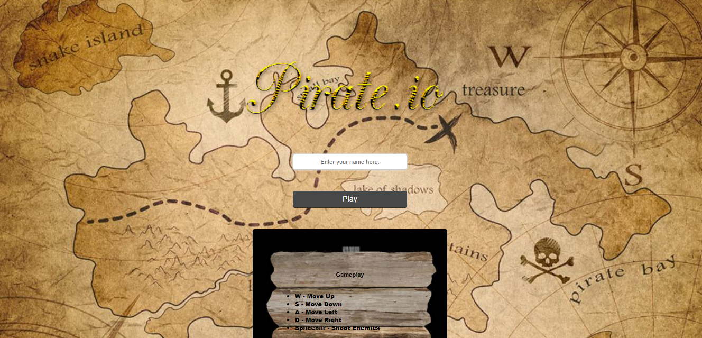

 
<h1 align="center">Pirate.io</h1>

  

## Inspiration

Introducing Pirate.io -- our twist to the classic game Agar.io! All of us loved the concept behind Agar.io, but we felt that more could be done to make it fun to play. Through this project, we sought to creatively optimize the experience of playing this game with a new theme and enhanced player controls.

## Overview

We've revamped this traditional game using a fun pirate theme. As a player, you can sail the seas, collect gold, and shoot cannon balls at other ships! We've also included health + progress bars in the player menu -- these will be updated as you get hit by cannonballs or collect gold, respectively.

## Built with:

For the front-end, Pirate.io was built using ThreeJs to create and display the animated 3D computer graphics.
For the back-end, Socket.io with Nodejs were useful for the multiplayer connection.

## Challenges

Foremost, we had never worked with ThreeJs or Socket.io before! Overall, we'd say the biggest challenge we came across was how to integrate ThreeJs with Node. Some of the other obstacles we faced were getting socket connections to work, rendering the scene, adjusting the camera, animating the ocean, collisions, and the physics of the ship's movement, among many others.

## Accomplishments

Some of us had never created a video game before, so we worked together as a team and supported each other every day. We are so proud of what we were able to build over the past few weeks!

## What we learned:

We learned our way around ThreeJs, socket.io, and mainly how a video game is built. We also learned how the physics work in a 3D world, and how a multiplayer video game can be implemented with sockets. We're incredibly happy with the final result. :)

 

## Additional Links
* [GitHub Repo](https://github.com/nathanlm511/Game.io)
* [Project Demo](https://youtu.be/ogDo_CewfDE)
