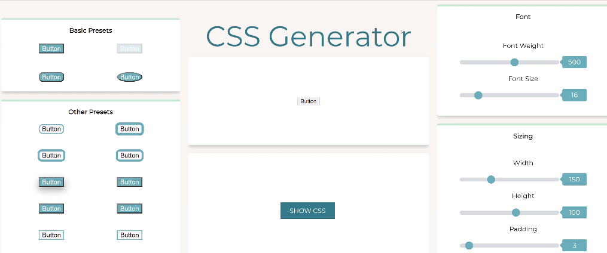

 
<h1 align="center">Comprehensive Style Society</h1>

  

## Inspiration

The theme for this project was to create something that would be helpful for Developer Tools & Productivity -- so we decided to create a CSS button generator to help developers easily export CSS code!

## Overview

The Comprehensive Style Society (aka CSS) is an application that allows a user to set customized styling to HTML button elements. We've created several types of properties for styling the button. The code generator tool can be used to create source code for the most useful CSS stylings; the code of the finalized button can be copied and exported to the user's personal application.

## Built with:

We primarily used React as the basic framework for our project -- especially when constructing the landing page + exporting the code + sliders to adjust the button attributes. All of the button presets were constructed in HTML + CSS.

## Challenges

Overall, we'd say the biggest challenge we came across was figuring out how to integrate the button presets within the rest of the app. Some of the other obstacles we faced were creating a "copy to clipboard" feature and perfecting the color generator.

## Accomplishments

None of us have ever built a project like this before, so we worked together as a team and supported each other every day. We are so proud of what we were able to build over the past few weeks!

## What we learned:

We learned our way around the React framework, and mainly how we could create additional components and integrate them into a cohesive product. In the future, we would love to expand on this application by adding other elements, such as Flexbox or editing forms. Overall, we're incredibly happy with the final result. :)

 

## Additional Links
* [GitHub Repo](https://github.com/SincerelyBrittany/comprehensive-style-society)
* [Project Demo](https://youtu.be/0IKVgYuatrY)

